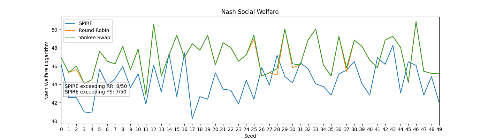

# Allocation Algorithms 

The following code consists of functions to solve the course allocation problem for Fall 2023 Umass Amherst courses. The algorithms are the current SPIRE algorithm (used currently by the UMass), Round Robin, and the proposed by Viswanathan and Zick(2023), Yankee Swap.

## Prerequisites

- Pandas
- Numpy
- Networkx
- openpyxl

## Instructions

## Preliminary results

